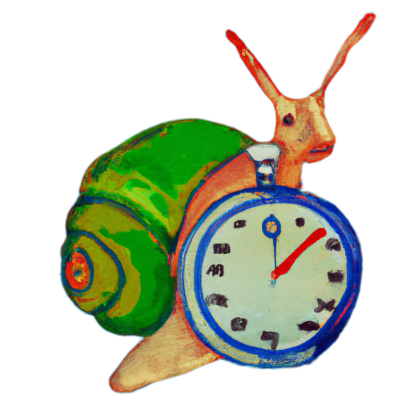
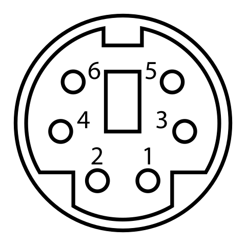

# douche lag
A modular lag testing device.
Still very much in the works right now.

*Amazingly cool and fancy logo of douche lag while keeping it SFW*

## Idea
The idea of douche lag is to have a simple and cheap, yet modular lag testing device to test the complete "lag chain" of a gaming system.
By "complete lag chain" I mean the time between button input and visual change on the screen.
Douche lag is doing that by emulating a button press and waiting for a visual change on screen.

The main idea is to be modular, that's why the project is split into 3 parts: The main board (containing the Raspberry Pi Pico and display), the "sense board" (which senses the visual change on the screen) and the "gamepad press emulation" (the part which actually emulates the button press).
The parts are connected using Mini DIN 6 cables/connectors.
The idea to keep it modular is to accomadate future updates.
Right now, it only supports displays which are back- or frontlit (since the sense board relies on a phototransistor) and gamepads which use a simple "commong ground switching" scheme.
To adapt this project to also non-lit displays, one could design a "sense board" with a color sensor.
Or more complex gamepads by designing a corresponding "gamepad daughter board".
Ideally, this potential future additions would not need a complete re-design, but only new daughter boards and a FW update.

## Test ROMs
Douche lag needs a program for each system to be tested which essentially toggles the display measurable by a button press.
Right now, there are ROMs for the following systems:
- GBA
- N64

## Gamepad Modification
Right now, only gamepads which use a "common ground switching" scheme are supported (meaning a button press will cause the button input to be tied to ground).
For this, it's required to connect the ground connection of the "PAD" connector to the gamepad's ground, and "PAD1" to the button causing the display toggle.
This can be done in different ways:
- Permanently modify gamepad by adding a Mini DIN 6 connector
- Creating a "probing" cable with, e.g., multimeter probing heads on one side and a Mini DIN 6 connector on the other side
- Whatever you can think of

## BOM
### Main board
| **Reference** | **Part** | **Link** |
|---------|------|------|
| U6 | Raspberry Pi Pico | [Digikey](https://www.digikey.com/en/products/detail/raspberry-pi/SC0915/13624793)|
| R1, R2 | 10k Ohm resistor 0805 | [LCSC](https://www.lcsc.com/product-detail/Chip-Resistor-Surface-Mount_UNI-ROYAL-Uniroyal-Elec-0805W8F1002T5E_C17414.html)|
| SW1, SW2 | Tactile switch | [LCSC](https://www.lcsc.com/product-detail/Tactile-Switches_BZCN-TSB008A2518A_C2888455.html)|
| PS1, PS2 | Mini DIN 6 connector | [LCSC](https://www.lcsc.com/product-detail/Circular-Connectors-Cable-Connectors_CONNFLY-Elec-DS1093-01-PN60_C77848.html)|
| PCB1 | 128x64 OLED display | [AliExpress](https://de.aliexpress.com/item/1005004242677199.html)|

**Make sure to get a display with the correct pinout order (VCC, GND, SCL, SDA) when looking from the top**

### Simple light sense board
| **Reference** | **Part** | **Link** |
|---------|------|------|
| R1 | 1 kOhm resistor 1206 | [LCSC](https://www.lcsc.com/product-detail/Chip-Resistor-Surface-Mount_UNI-ROYAL-Uniroyal-Elec-1206W4F1001T5E_C4410.html)|
| R3 | 100 kOhm resistor 1206 | [LCSC](https://www.lcsc.com/product-detail/Chip-Resistor-Surface-Mount_UNI-ROYAL-Uniroyal-Elec-1206W4F1003T5E_C17900.html)|
| IR1 | Phototransistor 1206 | [LCSC](https://www.lcsc.com/product-detail/Phototransistors_Everlight-Elec-PT11-21C-L41-TR8_C16746.html)|
| Q1 | 2N7002 NMOS-FET SOT-23 | [LCSC](https://www.lcsc.com/product-detail/MOSFETs_Jiangsu-Changjing-Electronics-Technology-Co-Ltd-2N7002_C8545.html)|
| PS1 | Mini DIN 6 connector | [LCSC](https://www.lcsc.com/product-detail/Circular-Connectors-Cable-Connectors_CONNFLY-Elec-DS1093-01-PN60_C77848.html)|

## Usage
The main board simulates periodically a button press and meaures the time between this button press and the change on screen.
The button press is "emitted" via the Mini DIN 6 connector labelled "PAD".
Right now, effectively only two wires are used here to simulate a button press: ground and "PAD1".
This is enough for gamepads which use a "common ground switching scheme".

## Pinout Main Board to Gamepad Board
The following image shows a Mini DIN 6 connector (female, the one main board).

| **Mini DIN 6 Pin** | **PAD Name** |
|---------|------|
| 1 | Ground |
| 2 | PAD1 |
| 3 | PAD2|
| 4 | PAD3|
| 5 | PAD4|
| 6 | PAD5|

Right now, none of the PAD connection beside Ground and PAD1 connections are used.

## Disclaimer
**Use the files and/or schematics to build your own device at your own risk**.
This project works fine for me, but it's a simple hobby project, so there is no liability for errors in the schematics and/or board files.
**Use at your own risk**.
